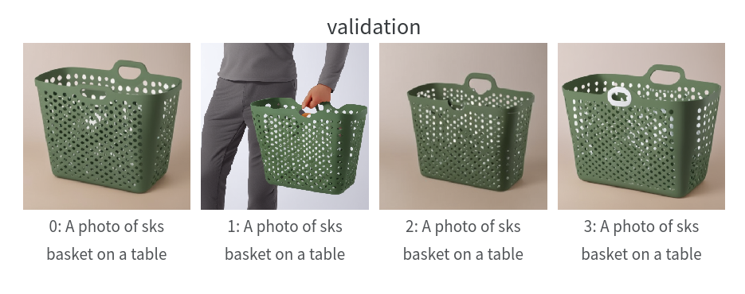

# Dreamobooth experiments 

## Hello world expriment -  Run 1

Just `train_dreambooth_lora.py` with default settings + train text enabled + prior loss (reduce overfitting).

> 💡 **Relevant Config**: 
> - Model: SD 1.5
> - Prior loss: True
> - Train text encoder: True
> - Lr: 1e-4
> - Num_steps: 500

")

Curretnly running for 500 steps at learning rate of 1e-4 (higher cause Lora is ok with that). 500 steps seems to be too much. 300 steps rpcudec the best result (qualitatively.)

")

## Deafult with SD 2 -  Run 2

### Dogs

Just `train_dreambooth_lora.py` with default settings + train text enabled + prior loss. Model is more photorealistic, I feel the dog is less similar to the groudtruth, struggle to put it into a bucket, it takes also more time (1 min more). At the end (in final test) GPU crushed due to memory. I will now use mixed precision probably. Also learning rate should be higher maybe. I will try a scheduler.

> 💡 **Relevant Config**: 
> - Model: SD 2.1
> - Prior loss: True
> - Train text encoder: True
> - Lr: 1e-4
> - Num_steps: 500

Best and worst example from this run

### Prime bottle

I tried the same thing on a blue prime bottle. Results are as expected, bottle sape a charcteristics are fine but the text is not captured at all (this is expected to be solve using SD3). 

### Ikea slubb (branded not branded)

In this case I provided only 3 images, the product was quite different in these images (in one I was held by a person and filled, in one just on the ground and filled and in another one the plain product). The model overfit a little bit because it produces images where the product is held by a human or on the ground (ignores that I promted "on the table") and the holes in the product are very weird.

Things I want to try: Different models, different configs (text_encoder for instance), 3-5 images vs 1 image augmented with different backgrounds

### Angry birds lamp

I tried to use augmentations using Photobooth to create more images. I am worried it might be overfitted and do not adapt for different scenarios. 

### Black bag

Same thing as for angry birds lamps. In this case I asked to create a bag in the background but it doesn't do that. So it is clearly overfitting. 

Overall it works here, overfitting is a bit of an issue.
## Deafult with SD XL with inpaiting -  Run 3

Directly trying inpaiting.

> 💡 **Relevant Config**: 
> - Model: SD XL
> - Prior loss: True
> - Train text encoder: True
> - Lr: 1e-4
> - Num_steps: 500

Noy enough memory. 

## Lora inpaiting with SD 2 -  Run 3

Directly trying inpaiting.

> 💡 **Relevant Config**: 
> - Model: SD2-inpaiting
> - Prior loss: True
> - Train text encoder: True
> - Lr: 1e-4
> - Num_steps: 800

Fail 

The non-inpainting model works well with lora, it is a little bit more trucky with the inpaiting. I still have to figure out how much is the drop in performace using 1-2 images for dreambooth if I am using augmentations. For now I am using the dataset from the original paper that should be fine. I am trying both with lora and without. I am trying different learning rates for lora as well. The diffuculty I am having might be related to the way the inpaiting model was trained, using random masks and general prompt for the image. 

DreaCOM paper seems to be able to overcome that somehow, after experiments aforementioned I will move towards that. Alternatively something clever to try would be to take the mask of the object and introce some randomness on the size and shape of the mask, as long as it convers the whole object and it is not too big.

Also, check happens when you set prior_loss true. Should be fine -> create image of object mask it randomly and fill, but have same issue just mentioned for random masking. And ddouble check the validaiton images are fine. 